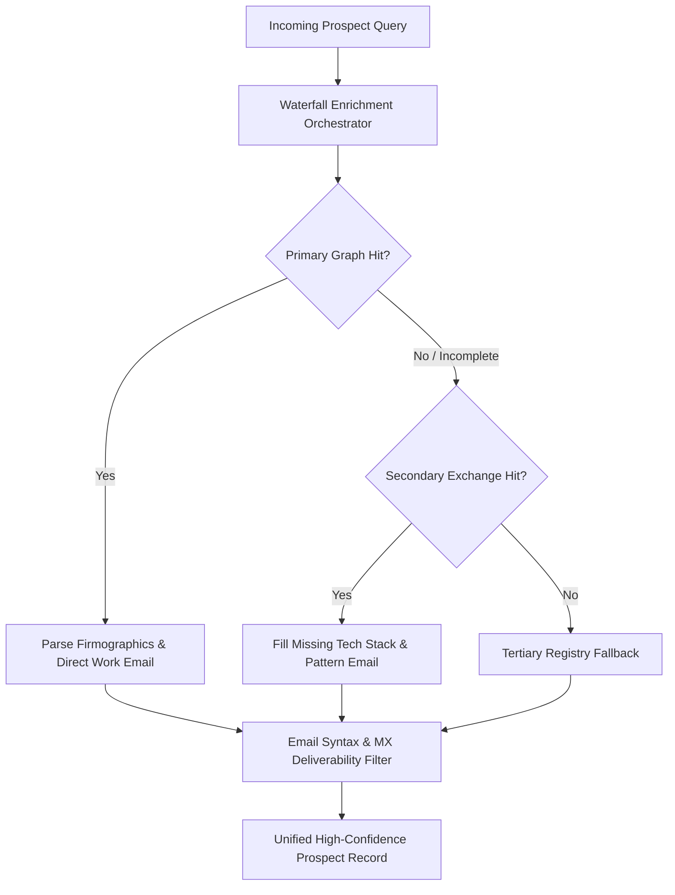

# GenPark AI Agent Skill - Waterfall Enrichment Orchestrator

Zero-dependency Python agent skill providing multi-tiered waterfall data enrichment for B2B prospects, verified decision-maker corporate emails, and firmographic telemetry.

Verified by [GenPark AI](https://genpark.ai) and compatible with [Model Context Protocol (MCP)](https://genpark.ai/mcp).

## Architecture Diagram



## Features
- **Deterministic Multi-Provider Cascade**: Eliminates single data source failure with automated fallback.
- **Strict Business Email Heuristics**: Distinguishes corporate domains from disposable and freemail providers.
- **Zero External Dependencies**: Standard Python 3.9+ library implementation.
- **MCP Server Compatibility**: Seamless integration with LLM agent tool calling via standard JSON-RPC.

## Quickstart

```python
from client import WaterfallEnrichmentOrchestrator

orchestrator = WaterfallEnrichmentOrchestrator()
prospect = orchestrator.enrich_prospect({
    "first_name": "Alex",
    "last_name": "Chen",
    "title": "CTO",
    "domain": "acmesystems.io"
})
print(prospect["target_contact"]["email"])
```
